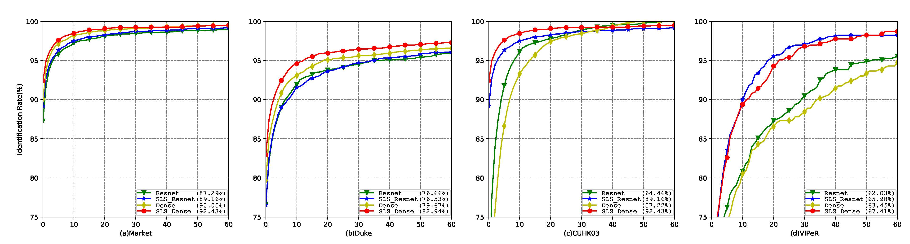

### SLS ReID

### Datasets
- Download [Market1501 Dataset](http://www.liangzheng.org/Project/project_reid.html)
- Download [DukeMTMC-reID Dataset](https://github.com/layumi/DukeMTMC-reID_evaluation)
- Download [CUHK03 Dataset](http://www.ee.cuhk.edu.hk/~xgwang/CUHK_identification.html)
- Download [VIPeR Dataset](https://vision.soe.ucsc.edu/node/178)

### Dataset preperation
Change the `download_path` to point to your dataset folder. Comment out `multi-query` except for `Market1501` dataset.
```bash
python prepare.py
python re_index.py
```
### Training
- Train the baseline
```bash
python train.py 
```
- Train SLS_ReID
```bash
python sls_train.py 
```
Add `--use_dense` argument to train using `DenseNet121` architecture

### Pre-trained models

| Dataset | Dense Baseline | ResNet Baseline |Dense SLS_ReID | ResNet SLS_ReID |
| --- | --- | --- | --- | --- | 
| Market-1501 | [market/dense.pth](https://drive.google.com/open?id=18_rb1c3m8YohQVv0ecWL1sgSKiaRNLur) | [market/resnet.pth](https://drive.google.com/open?id=1LUhaJR2k8jVtgdzKCbcgGmGoaj603OS9) | [cuhk03/dense_slsreid.pth](https://drive.google.com/open?id=1w9tENbW7XuWAcZ-i-MlIyMI6VCzjjf5z) | [market/resnet_slsreid.pth](https://drive.google.com/open?id=1COJy6QmGBxoqzR6TMruJuoR4PluB9lFY) | 
| CUHK03 | [cuhk03/dense.pth](https://drive.google.com/open?id=13qp4MIcbDB3dMDvgEcdMocxXL2ISwlE6) | [cuhk03/resnet.pth](https://drive.google.com/open?id=1F53kR_L2bk4ePUWpzRPM8lus9l1JTbkI) | [cuhk03/dense_slsreid.pth](https://drive.google.com/open?id=1M4ADdNYUlY5ne4AGcvuNhO2rviq8FYNd) | [cuhk03/resnet_slsreid.pth](https://drive.google.com/open?id=1D6cEuUmA9KcZ38d715XBdtT5kagSLZtc) | 
| VIPeR | [viper/dense.pth](https://drive.google.com/open?id=15MToMvqenWW7XmygATfm0WdjXIk6kU2J) | [viper/resnet.pth](https://drive.google.com/open?id=1cvEWoEflXGkp6FQ3n3_sa3gOGtbb4s2o) | [viper/dense_slsreid.pth](https://drive.google.com/open?id=1_gepm1yvi0dsoB3rv_uRof6MasSLVyg8) | [viper/resnet_slsreid.pth](https://drive.google.com/open?id=1iVwJC8VYfGaHoUJViZglS1v2tcb2wQi2) |  
| DukeMTMCReID | [duke/dense.pth](https://drive.google.com/open?id=1tg-gEF87DoRLaBGVgfo6bXlZR-Rdm_uh) | [duke/resnet.pth](https://drive.google.com/open?id=1H-T-oegGeHB6x-QG5TEtFeMrrN1eLn_M) | [duke/dense_slsreid.pth](https://drive.google.com/open?id=139ngCD9PuHIQvqV4X5bZ-4_Y8G-ZQ03S)| [duke/resnet_slsreid.pth](https://drive.google.com/open?id=1a6scaF0-rnTbpn5gbEGlzgXhK0R4X_LI) |

To generate the GAN label (`gan%.list` ie `gan0.list`, `gan1.list` and `gan2.list` for three cluster ), run `generate_labels_for_gan`:
 
 ```
 python prepare_gan_data.py
 ```
### Testing

```bash
python test_cuhk03.py --model_path ./cuhk03/model.pth --use_dense
python eval_cuhk03.py
----------
python test_viper.py --model_path ./viper/model.pth --use_dense
%Add --re_rank to get re-ranking with k-reciprocal encoding
----------
python test.py --model_path ./market/model.pth --use_dense
python evaluate.py
python evaluate_rerank.py 
%Add --multi for multi-query evaluation
```

### Currents results

| Dataset | Rank 1 | Rank 5 | Rank 10 | Rank 20 | mAP |
| --- | --- | --- | --- | --- | --- |
| `CUHK03-Dense Baseline` | 67.92% | 90.94% | 95.35% | 97.78% | 78.10% |
| `CUHK03-Dense SLS_ReID` | 84.32% | 97.13% | 98.92% | 99.63% | 89.92% |
| `CUHK03-ResNet Baseline` |75.02% | 95.08% | 97.92% | 99.11% | 83.87% |
| `CUHK03-ResNet SLS_ReID` | 90.99% | 98.24% | 99.25% | 99.74% | 94.18% |
| `VIPeR-Dense Baseline` | 63.45% | 72.78% | 79.11% | 86.23% | - |
| `VIPeR-Dense SLS_ReID` | 67.41% | 81.01% | 88.61% | 93.51% | - |
| `Market-1501-Dense Baseline` | 90.05% | 96.82% | 98.10% | 98.81% | 74.16% |
| `Market-1501-Dense SLS_ReID` | 92.43% | 97.27% | 98.40% | - | 79.08% |							
| `Market-1501-ResNet Baseline` | 87.29% | 95.57% | 96.94% | - | 69.70% |							
| `Market-1501-ResNet SLS_ReID` | 89.16% | 95.78% | 97.33% | - | 75.15% |							
| `DukeMTMC-ReID-Dense Baseline` | 79.67% | 89.85% | 92.86% | 95.11% | 63.19% |
| `DukeMTMC-ReID-Dense SLS_ReID` | 82.94% | 91.69% | 94.43% | 95.96% | 67.78% |
| `DukeMTMC-ReID-ResNet Baseline` | 76.66% | 87.83% | 91.47% | 93.76% | 58.35% |
| `DukeMTMC-ReID-ResNet SLS_ReID` | 76.53% | 88.15% | 91.02% | 93.54% | 60.79% |

### Multi-query results for Market-1501 dataset

| Dataset | Rank 1 | Rank 5 | Rank 10 | mAP |
| --- | --- | --- | --- | --- |
| ResNet baseline | 91.27% | 96.85% | 98.19% | 76.94% |	
| DenseNet baseline | 92.90% | 97.89% | 98.69% | 81.22% |	
| Resnet SLS_ReID | 92.25% | 97.51% | 98.34% | 81.92% |
| Dense SLS_ReID | 94.06% | 98.16% | 98.84% | 85.20% |

### References
```
@ARTICLE{AinamSLSR2018,
    author = {{Ainam}, J.-P. and {Qin}, K. and {Liu}, G. and {Luo}, G.},
    title = "{Sparse Label Smoothing for Semi-supervised Person Re-Identification}",
    journal = {ArXiv e-prints},
    archivePrefix = "arXiv",
    eprint = {1809.04976},
    year = 2018,
    month = sep,
}
```


